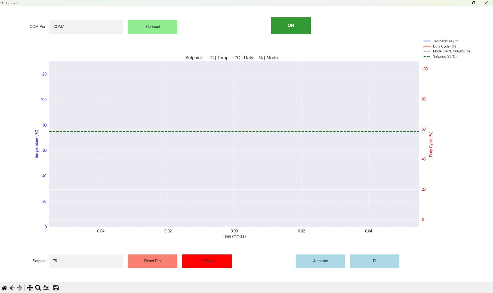

# Arduino Temperature Monitoring and Control GUI

This Python script provides a graphical user interface (GUI) for monitoring and controlling an Arduino-based temperature control system. It communicates with the Arduino via a serial connection, plots real-time temperature, duty cycle, and mode data, and includes safety features like temperature warnings and an emergency stop (E-Stop). The script uses Matplotlib for plotting and Tkinter for dialogs, with data logging to an Excel file.

## Features
- **Real-Time Plotting**: Displays temperature (°C), duty cycle (%), and mode (PI or Autotune) over time.
- **Serial Communication**: Connects to an Arduino via a specified COM port (default: COM7).
- **Control Commands**: Send `AUTOTUNE`, `PI`, `Sxx.x` (setpoint), and `H0` (stop) commands to the Arduino.
- **Safety Features**:
  - Temperature warnings at 100°C and critical shutdown at 115°C.
  - Emergency Stop (E-Stop) button to disable the heater.
  - Setpoint limits (max 85°C) with confirmation for high values (>80°C).
- **Data Logging**: Saves timestamped data (setpoint, temperature, duty cycle, mode) to `temperature_data.xlsx`.
- **Interactive Controls**:
  - Connect/Disconnect button for serial communication.
  - Setpoint input with validation.
  - Autotune and PI mode buttons.
  - Reset plot button.
  - E-Stop indicator showing heater status.
- **Test Mode** (optional): Simulate temperature data for debugging (hidden by default).


*Screenshot of the temperature monitoring GUI showing real-time plots and controls.*

## Requirements
- **Python 3.x**: Install from [python.org](https://www.python.org).
- **Libraries**:
  - `pyserial`: For serial communication.
  - `matplotlib`: For plotting.
  - `pandas`: For data handling and Excel export.
  - `openpyxl`: For Excel file writing.
  - `tkinter`: Built-in with Python for dialogs.

Install dependencies via pip:
```bash
pip install pyserial matplotlib pandas openpyxl